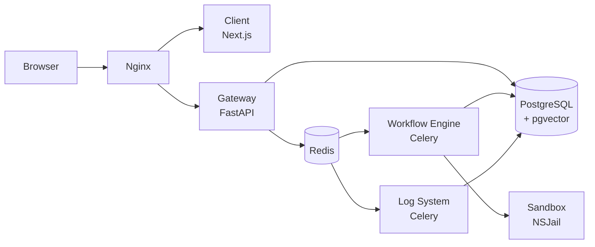

<div align="center">


# Nodease

**Nodease는 기업 내부 AI workflow를 자연어로 설계하고, 권한 있는 사내 지식과 연결하며,<br/>
실행 비용과 감사 이력을 함께 운영하는 AI workflow/LLMOps 오픈소스 플랫폼입니다.**

[](./LICENSE)
[](https://www.python.org/)
[](https://nextjs.org/)
[](https://docs.docker.com/compose/)

</div>

---

## Nodease란?

Nodease는 사내 여러 팀이 AI workflow를 만들고 실행하고 배포할 수 있게 하는 기업 내부 플랫폼입니다. 노드를 연결하는 시각적 workflow builder, 자연어 기반 Agent Builder, Organization/Team 단위 RBAC, 권한 기반 RAG, Audit/Trace, LLM 사용량·비용 관측, LLMOps 기능을 사용할 수 있습니다.

## Quick Start

Nodease를 빠르게 시작하려면 Docker Compose를 이용하세요. 프로젝트 루트 폴더에서 다음 명령어를 수행하여 로컬에서 서버를 띄울 수 있습니다. Docker와 Docker Compose가 설치되어 있어야 합니다.
```
cp docker/.env.example docker/.env
# docker/.env에서 ENCRYPTION_KEY 설정

cd docker
docker compose build
docker compose up -d --wait gateway
docker compose up -d
```

- Web UI: [http://localhost](http://localhost)
- API health: [http://localhost/api/v1/health](http://localhost/api/v1/health)

## Key features

| 핵심 기능                             | 기능 설명                                                                                          |
| -------------------------------- | ---------------------------------------------------------------------------------------------------------------- |
| **Workflow**      | 시각적 graph 편집, 테스트 실행, 배포, 수동·Schedule·Webhook·API·챗봇 실행. |
| **Agent Builder**     | 자연어 업무 설명을 workflow로 생성해 Editor에 적용하고, 필요한 설정을 확인한 뒤 저장합니다. |
| **RBAC 기반 RAG** | 실행 사용자가 접근할 수 있는 Knowledge Base만 RAG 검색 후보와 citation에 포함합니다.                             |
| **Audit, Tracing**             | 주요 행위와 node 실행을 Audit·Trace로 연결하고, 일반 조회에는 visibility·redaction 정책을 적용합니다.            |
| **LLMOps**           | workflow와 LLM node의 token, 비용, latency를 관측하고 동일 입력 기반 후보 설정을 비교합니다.                     |

## Architecture

다음은 통합 컨테이너 실행 기준의 논리 구조입니다.



| 경로                                    | 책임                                                                         |
| --------------------------------------- | ---------------------------------------------------------------------------- |
| `apps/client/`                          | Next.js UI. Workflow 편집, Knowledge, RBAC, Admin·observability 화면         |
| `apps/gateway/`                         | FastAPI 진입점. 인증, organization context와 resource permission enforcement |
| `apps/workflow_engine/`                 | Celery 기반 workflow 실행과 node runtime                                     |
| `apps/log_system/`                      | Audit·Trace·log 계열 비동기 처리                                             |
| `apps/shared/`                          | DB model, schema, permission, LLM client, RAG와 tracing 공통 계층            |
| `apps/sandbox/`                         | NSJail 기반 Python code 실행 격리                                            |
| `docker/`, `dev/`, `infra/`, `scripts/` | 통합 컨테이너, 로컬 개발, provider-neutral Helm과 운영 script                |

세부 서비스 경계와 요청 흐름은 현재 코드와 실행 가능한 테스트를 기준으로 확인합니다. `docs/`는 재검증 전까지 제품·아키텍처 판단 근거로 사용하지 않습니다.

## Technical Challenges

- 기술적 챌린지 추가 예정

## Tech Stack

| 영역           | 기술                                                                                |
| -------------- | ----------------------------------------------------------------------------------- |
| Frontend       | Next.js 16, React 19, TypeScript, Tailwind CSS, React Flow                          |
| Gateway        | Python 3.11, FastAPI, SQLAlchemy                                                    |
| Runtime        | Celery, Redis                                                                       |
| Database       | PostgreSQL, pgvector                                                                |
| LLM/RAG        | OpenAI·Anthropic·Google client, document ingestion, metadata/hierarchical retrieval |
| Sandbox        | NSJail                                                                              |
| Infrastructure | Docker Compose, provider-neutral Kubernetes Helm                                    |
| Test           | pytest, Vitest, ESLint, Next.js build                                               |

현재 저장소가 제공하는 배포 artifact는 Docker Compose와 provider-neutral Helm chart입니다. EKS 전용 provisioning·raw manifest·CD는 저장소에 포함하지 않습니다.

## Start in development environment

### Prerequisites

- Python 3.11.x
- Node.js 20.9 이상과 npm
- Docker Compose v2
- Bash

### Setup & Run

**macOS / Linux**
```bash
# 1. 환경 파일 준비
cp dev/.env.example .env
# .env에서 ENCRYPTION_KEY 등 필수 secret을 설정합니다.

# 2. 개발 의존성 설치
./scripts/setup.sh

# 3. PostgreSQL 시작 및 준비 대기
docker compose -f dev/docker-compose.yml up -d --wait postgres

# 4. DB schema를 최신 상태로 갱신
apps/gateway/.venv/bin/python -m alembic \
  -c apps/shared/alembic.ini upgrade heads

# 5. 개발 서비스 실행
./scripts/dev.sh
```

**Windows**에서는 **Git Bash**를 사용해야 합니다.
```bash
# 1. 환경 파일 준비
cp dev/.env.example .env
# .env에서 ENCRYPTION_KEY 등 필수 secret을 설정합니다.

# 2. 개발 의존성 설치
./scripts/setup.sh

# 3. PostgreSQL 시작 및 준비 대기
docker compose -f dev/docker-compose.yml up -d --wait postgres

# 4. DB schema를 최신 상태로 갱신
apps/gateway/.venv/Scripts/python.exe -m alembic \
  -c apps/shared/alembic.ini upgrade heads

# 5. 개발 서비스 실행
./scripts/dev.sh
```

| Service  | URL                                                      |
| -------- | -------------------------------------------------------- |
| Client   | [http://localhost:3000](http://localhost:3000)           |
| Gateway  | [http://localhost:8000](http://localhost:8000)           |
| API Docs | [http://localhost:8000/docs](http://localhost:8000/docs) |
| Sandbox  | [http://localhost:8194](http://localhost:8194)           |
| pgAdmin  | [http://localhost:5050](http://localhost:5050)           |

`Ctrl+C`로 host process와 개발용 Compose 서비스를 함께 종료합니다.

### LLM credential rotation

Schema upgrade와 새 keyring을 받은 Gateway/Worker 배포가 완료된 뒤에만 Gateway container에서 제한 batch rotation을 실행합니다.

```bash
docker compose \
  --env-file docker/.env \
  -f docker/docker-compose.yml \
  exec -T gateway \
  python /app/scripts/rotate_llm_credentials.py --batch-size 100 --max-batches 10

docker compose \
  --env-file docker/.env \
  -f docker/docker-compose.yml \
  exec -T gateway \
  python /app/scripts/rotate_llm_credentials.py --check
```

Helm 환경도 migration과 Gateway readiness가 완료된 뒤 같은 Gateway image의 `/app/scripts/rotate_llm_credentials.py`를 단일 운영 명령으로 실행합니다.

```bash
kubectl -n <namespace> exec deployment/<release>-gateway -- \
  python /app/scripts/rotate_llm_credentials.py --batch-size 100 --max-batches 10
```

`--check`가 pending 0을 확인한 뒤에만 구키를 제거합니다. 명령 출력에는 credential config, ciphertext 또는 key가 포함되지 않습니다.

### Provider usage outcome reconciliation

`outcome_unknown` provider usage는 provider 또는 billing 근거로 결과를 독립적으로 확인한 뒤에만 Gateway container의 no-replay 운영 명령으로 해소합니다. 명령 실행 권한과 사람 actor 추적은 platform IAM/운영 감사가 소유하며, 이 명령은 provider를 재호출하지 않고 raw request/response나 credential을 입력받지 않습니다.

성공이 확인된 경우 sealed admission의 token·가격·cost cap과 일치하는 측정값을 입력합니다.

```bash
python /app/scripts/reconcile_provider_usage.py \
  --organization-id <organization-uuid> \
  --operation-id <operation-uuid> \
  --expected-state-version <version> \
  --resolution succeeded \
  --prompt-tokens <count> \
  --completion-tokens <count> \
  --total-cost-microusd <amount> \
  --latency-ms <milliseconds>
```

Provider가 요청을 받지 않았거나 인증·인가 단계에서 확정 거절한 근거가 있는 경우에만 safe definitive reason을 사용합니다.

```bash
python /app/scripts/reconcile_provider_usage.py \
  --organization-id <organization-uuid> \
  --operation-id <operation-uuid> \
  --expected-state-version <version> \
  --resolution failed_definitive \
  --reason-code provider_not_sent
```

Organization, operation 또는 expected state version이 현재 row와 정확히 일치하지 않거나 측정값이 immutable snapshot과 다르면 zero-write로 실패합니다. 같은 attempt를 다시 실행해 unknown을 해소해서는 안 됩니다.

## Testing

Backend, Shared, Workflow Engine, Log System, Sandbox와 Client build를 포함한 저장소 검증:

```bash
./scripts/test.sh
```

Client lint, unit test와 production build는 별도로 실행합니다.

```bash
cd apps/client
npm run lint
npm run test
npm run build
```

## License

이 프로젝트는 [MIT License](./LICENSE)를 따릅니다.

---

<div align="center">
  Nodease — Build AI workflows. Govern knowledge. Trace every run.
</div>
